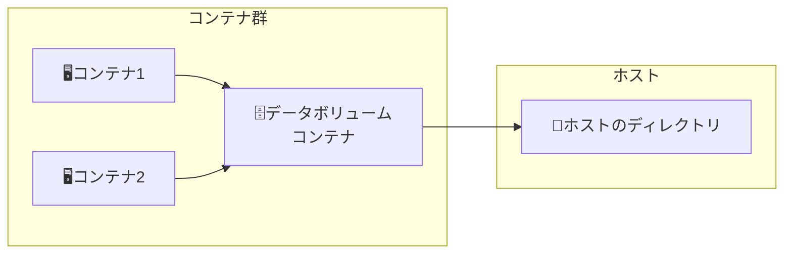

# Docker 　コンテナ開発・環境構築の基本

# 市川豊著、インプレス社、ISBN978-4-295-01173-6、C3055、\3000E

# chap02

## docker hub

- docker hub にレポジトリ作成

# Chap03

## add と copy

add はファイル、ディレクトリ、tar、ネットワーク上のリソース
copy はファイルと、ディレクトリのみ

## CMD と ENTORYPOINT

docker container RUN <コンテナ名> <実行プロセス> <引数>
の実行時、CMD はデフォルト値のようにふるまい、
ENTORYPOINT は原則上書きできない。ただし、--entrypoint を付けると上書きできる。

## 3-1-1-01 　 image の build

image の Build

- docker image build -t [コンテナイメージ名] [Dockerfile のパス]

例：

```
export DOCKERHUB_REPO_NAME="zeta80a"
docker image build -t ${DOCKERHUB_REPO_NAME}/sample-nginx .
```

コンテナイメージの確認

- docker container ls [オプション]

例：

```
ocker container ls
```

build の履歴をみる

- docker image history [オプション] コンテナイメージ名

例：

```
docker image history ${DOCKERHUB_REPO_NAME}/sample-nginx
```

## 3-1-1-03 　マルチステージビルド & RUN

## 概要

・マルチステージビルドは各ステージ毎にの成果物を次のステージの入力としてりようすることができる。
例えば、FROM golang:1.16.4-alpine3.13 AS builder
の AS 句で builder を指定。

・次のステージで--from=builder オプションで前のステージの成果物を指定できる。
例：

```
COPY --from=builder /msb /usr/local/bin/msb
```

・ステージの区切りは FROM 句

## Run

・image の Build。Dockerfile のファイル名が非デフォルトの場合。

- docker image build -t [コンテナイメージ名] -f [Dockerfile のファイル名] [Dockerfile のパス]

例：

```
docker image build -t msb -f Dockerfile-msb .
```

・image の Run

- docker containter run [オプション] イメージ名 [コマンド] [ARG...]

例：

```
docker containter run -it --rm msb
```

### コンテナの内容確認コマンド

イメージを指定してコンテナを対話的に起動後、entrypoint を無視して ls を実行し、コンテナを削除する。

- docker container run -it --rm [--entrypoint コマンド名] イメージ名 [コマンドに渡すオプション]

例：

```
docker container run -it --rm --entrypoint ls msb -la /usr/local/bin/
docker container run -it --rm --entrypoint vi msb /etc/hosts
```

## 3-2-2 コンテナセキュリティ

### trivy

・trivy のインストール

例：

```
curl -sfL https://raw.githubusercontent.com/aquasecurity/trivy/master/contrib/install.sh | sudo sh -s -- -b /usr/local/bin

```

・trivy によるセキュリティチェック

- trivy image [イメージ名]

例：

```
trivy image ${DOCKERHUB_REPO_NAME}/sample-nginx
```

## 3-2-4 イメージの push/pull & tag 付け

### docker hub へのログイン

- docker login [オプション] [サーバ]

例：

```
docker login
```

(以下の出力。XXXX-XXXX を https://login.docker.com/activateを開いて入力。githubと同じ形式)

```
USING WEB-BASED LOGIN

i Info → To sign in with credentials on the command line, use 'docker login -u <username>'

Your one-time device confirmation code is: XXXX-XXXX
Press ENTER to open your browser or submit your device code here: https://login.docker.com/activate

Waiting for authentication in the browser…

WARNING! Your credentials are stored unencrypted in '/home/username/.docker/config.json'.
Configure a credential helper to remove this warning. See
https://docs.docker.com/go/credential-store/　）
```

### push & pull

コンテナイメージを DockerHub のレポジトリにプッシュ

- docker image push [オプション] コンテナイメージ名 [:タグ]

例：

```
docker image push ${DOCKERHUB_REPO_NAME}/sample-nginx
```

コンテナイメージを DockerHub のレポジトリからプル

- docker image pull [オプション] コンテナイメージ名 [:タグ]

例：

```
docker image pull ${DOCKERHUB_REPO_NAME}/sample-nginx
```

### タグ付け

- docker image tag ソースコンテナイメージ名[:タグ]　ターゲットコンテナ名[:タグ]

例：

```
docker image tag 8a7fab2601fc ${DOCKERHUB_REPO_NAME}/sample-nginx:1.0
```

## 3-3-2 　コンテナ操作

・コンテナ起動
-d:バックラウンド起動
-p:ポート指定。書式は"ホストポート"："コンテナポート"。

- docker container run --name コンテナに付与する名前 -d -p ホストポート:コンテナポート イメージのレポジトリ名

例：

```
docker container run --name sample-nginx -d -p 8080:80 ${DOCKERHUB_REPO_NAME}/sample-nginx
```

・コンテナ接続
-i:標準ターミナルを開いたまま
-t:仮想ターミナル割り当て

- docker container exec -it コンテナ名 コンテナ内で実行するコマンド

例：

```
docker container exec -it sample-nginx /bin/bash
```

・コンテナ停止

- docker container stop コンテナ名

例：

```
docker container stop sample-nginx
```

・コンテナ開始

- docker container start コンテナ名

例：

```
docker container start sample-nginx
```

・コンテナへのコピー

- docker container cp [オプション] ホストのコピー元パス　コンテナ名:コンテナ内のパス

例：

```
docker container cp copy.html sample-nginx:/usr/share/nginx/html
```

・コンテナの稼働状況確認
コンテナの稼働状況をレポート。linux の top に同じ。ctrl+c で終了。

- docker container stats [オプション] コンテナ名

例：

```
docker container stats sample-nginx
```

・コンテナの詳細情報を調査
コンテナの内部情報を JSON 形式で出力

- docker container inspect [オプション] コンテナ名

例：

```
docker container inspect sample-nginx
```

・コンテナを削除
コンテナを削除。ただし、事前にコンテナを停止すること。

- docker container rm [オプション]　コンテナ名

例：

```
docker container rm sample-nginx
```

・コンテナのログ収集
コンテナが出力するログを取得。
あらかじめ,Dockerfile でコンテナの標準出力、およびエラー出力を access.log などにソフトリンクしておく。
（例：# アクセスログとエラーログを標準出力に出力

例：Dockerfile 中に記述する。

```
RUN ln -sf /dev/stdout /var/log/nginx/access.log && ln -sf /dev/stderr /var/log/nginx/error.log）
```

- docker container logs sample-nginx

例：

```
docker container logs sample-nginx
```

## 3-3-3 　永続化データ

永続化データは 3 種類
・バインドマウント(Bind mount)
・ボリューム(Volume)
・一時ファイルシステムマウント(tmpfsmount)

### 3-3-4 　マウント

オプション
--mount:ホスト上にパスが存在しない場合、エラーになる。
-v:ホスト上にパスが存在しない場合、作成する。
[--mount のパターン]

- docker container run --name コンテナ名 -d -p ホストポート:コンテナポート --mount type=bind,source=ホスト側ディレクトリパス,target=コンテナ側ディレクトリパス コンテナイメージ名
  [-v のパターン]
- docker container run --name コンテナ名 -d -p ホストポート:コンテナポート -v ホスト側ディレクトリパス:コンテナ側ディレクトリパス コンテナイメージ名

例[--mount のパターン]：

```
docker container bind-nginx -d -p 8080:80 --mount type=bind,source=/home/ginka/projects/LERAN/Docker/dev-env-cons-bas/Chapter03/3-3-4-01/htdocs,target=/usr/share/nginx/html nginx 　
```

例[-v のパターン]：

```
docker container run --name bind-nginx -d -p 8080:80 -v /home/ginka/projects/LERAN/Docker/dev-env-cons-bas/Chapter03
/3-3-4-01/htdocs:/usr/share/nginx/html nginx
```

### 3-3-5 　 Volume

・ボリューム作成

- dcoker volume create [オプション] ボリューム名

例：

```
dcoker volume create htdocs
```

・ボリュームマウント

- docker container run --name 付与するコンテナ名 -d -p ホストのポート:コンテナのポート -v ボリューム名:コンテナディレクトリパス コンテナイメージ名

例：

```
docker container run --name volume-nginx -d -p 8080:80 -v htdocs:/usr/share/nginx/html nginx
```

・作成した volume にアクセス
　作成した Volume は"/var/lib/docker/volumes/htdocs/\_data"に作成される。sudo で各種コマンドを実行して確認できる。

例：

```
sudo ls /var/lib/docker/volumes/htdocs/_data
sudo cp -p /home/ginka/projects/LERAN/Docker/dev-env-cons-bas/Chapter03/3-3-4-02/volume.html /var/lib/docker/volumes/htdocs/_data/volume.html
```

### 3-3-6 一時ファイルシステム

停止して、起動すると一時ファイルシステムに保存したデータはすべて消えている。

- docker container -itd --name 付与するコンテナ名 --mount type=tmpfs,destination=コンテナ側ディレクトリパス,tmpfs-size=マウントサイズ,tmpfs-mode=ファイルモード(8 進数) コンテナイメージ名

例：

```
docker container run -itd --name tmpfs-nginx --mount type=tmpfs,destination=/root/tmp,tmpfs-size=10,tmpfs-mode=755 nginx
```

### 3-3-7 データボリュームコンテナ

複数のコンテナで共有できるボリューム。Docker 内の NAS のようなもの。



・データボリュームコンテナを作成
　このコマンドでホストのあるディレクトリを、データボリュームコンテナのあるディレクトリにマウントする。

- docker container run -it -d --name データボリュームコンテナ名 -v ホストディレクトリ:データボリュームコンテナディレクトリ イメージ名

例：

```
docker container run -it -d --name data-volume -v /tmp/data-volume/share:/tmp/data busybox
```

・データボリュームコンテナに接続するコンテナを作成

- docker container run -it -d --name 付与コンテナ名 --volumes-from データボリュームコンテナ名 イメージ名

例：

```
docker container run -it -d --name share01 --volumes-from data-volume ubuntu
```

### 3-3-8 コンテナのネットワーク

Docker のネットワークは以下の 3 種
・none :スタンドアロン。ホストとネットワーク接続しない
・host :一台のみホストに接続
・bridge :ブリッジを使用してホストに接続

bridge を使えば、コンテナのポート番号は bridge が異なれば、競合しない。
--network オプションで bridge 名を指定する。指定しない場合は docker0 が使用される。

#### ネットワーク確認

ホストで以下のコマンドで作成されている bridge を確認できる。

例：

```
ip a
```

docker で作成された network の一覧を表示

```
docker network ls
```

#### 例：wordpress サーバと Mysql サーバインストール

・wordpress と mysql サーバをインストール

[mysql]

```
docker container run -d --name mysql \
--network wordpress-network \
-e MYSQL_ROOT_PASSWORD=wordpress \
-e MYSQL_DATABASE=wordpress \
-e MYSQL_USER=wordpress \
-e MYSQL_PASSWORD=wordpress \
mysql:8.0.25
```

[wordpress]

```
docker container run -d --name wordpress \
--network wordpress-network -p 8080:80 \
-e WORDPRESS_DB_HOST=mysql:3306 \
-e WORDPRESS_DB_NAME=wordpress \
-e WORDPRESS_DB_USER=wordpress \
-e WORDPRESS_DB_PASSWORD=wordpress \
wordpress:php7.4-apache
```

## 3-4 コンテナとコンテナイメージの一括削除

・不要な docker コンテナを全て削除

```
docker container prune
```

・不要なイメージを全て削除

```
docker image prune -a
```

# Chap04
